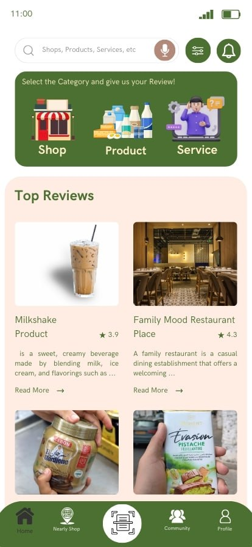

# Task 2: Implement the First UI in view/MainScreen

## Code Explanation

The codebase is structured around the Rayna application using **MVVM Architecture**. Here are the key components:

1. **ProductViewModel**: Handles the business logic related to products.
2. **MainActivity**: Acts as the entry point of the application.
3. **MainScreen**: Composable that displays the UI, including the list of products.
4. **ProductRepository**: Acts as a repository for products.
5. **LocationRepository**: Manages location data.
6. **Product Model & Location Model**: Define the data structure for products and locations.

## Task

Your task is to implement the first UI in `view/MainScreen` based on the design provided in `FirstUI.jpg`. The UI should include:

- A list of products and locations.
- A navigation bar.
- A product detail view when a product is selected.
- A search bar to filter products and location by name.

### Additional Requirements

1. **Add More Products and Locations**:
   - Add at least 5 more products to the mock data in `ProductRepository.kt` and more locations to `LocationRepository.kt`.
   - Ensure the new products and locations are displayed in the UI.

2. **Implement Search Functionality**:
   - Add a search bar to the top of the `view/MainScreen` UI.
   - Implement functionality to filter the products list based on the search query (e.g., by product name or location).

## Instructions

1. Open `view/MainScreen.kt`.
2. Implement the UI layout in `view/MainScreen`.
3. Use the `ProductViewModel` to fetch and display products.
4. Ensure the UI matches the design in `FirstUI.jpg`.

## FirstUI

Good luck!
